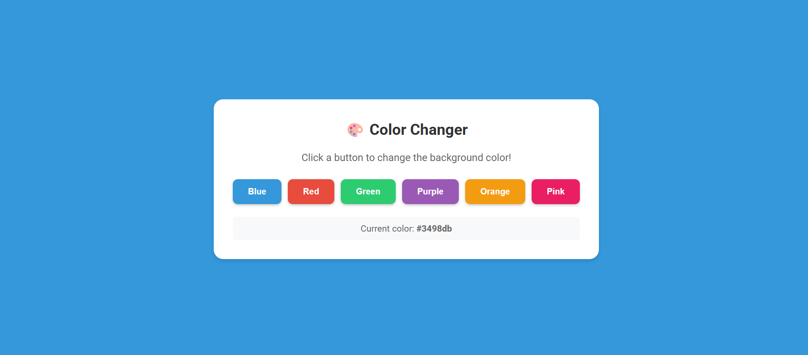

## 🎨 Color Changer

A simple React app that changes the background color with button clicks.

### Demo
[Live Demo]()

### Features
- Click buttons to change background color
- Smooth color transitions

### Setup
`git clone` https://github.com/gautam-32b7/color-changer.git

`cd` color-changer

`npm install`

`npm run dev`

### Tech Stack
- React
- CSS3
- JavaScript

### Available Colors
- Blue
- Red
- Green
- Purple
- Orange
- Pink